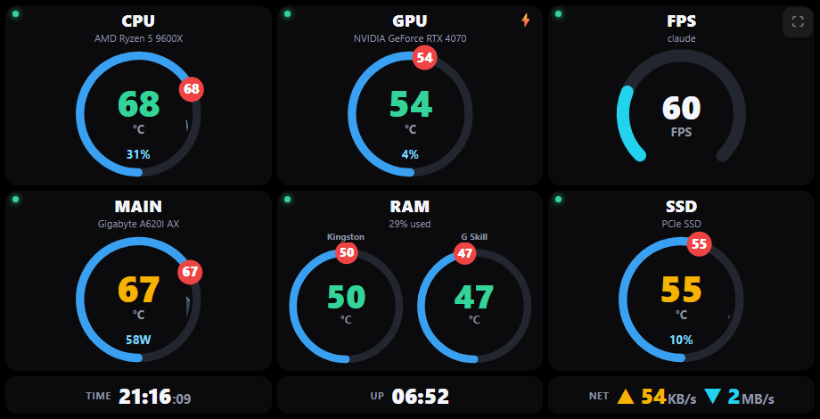

# PC Temp Monitor

**Turn an old phone into a live PC temperature & FPS monitor — over WiFi.**

Reads your PC's hardware temperatures (CPU, GPU, motherboard, RAM, SSD) **and your
live in-game FPS**, and shows them on your phone **over WiFi** as a compact,
single-screen dashboard of fishbowl gauges — temperature with a 24-hour max marker,
load shown as the water level, plus network, clock and uptime.

## How it works
- **collector.ps1** — loads LibreHardwareMonitor, reads all sensors, reads FPS from
  PresentMon, and serves the dashboard + JSON API on `http://localhost:8085`.
- **dashboard.html** — the mobile dashboard: one tile per component (title, device,
  big value, icon, sparkline). FPS is the hero tile at the top. Tap **⛶ Full** for
  fullscreen. Fits one screen, no scrolling.
- **Start-Monitor.ps1 / .cmd** — one-click launcher: frees the port, elevates to
  admin, starts FPS capture, sets up the USB tunnel with `adb reverse`, and opens
  the dashboard on the phone.
- **presentmon.exe** — Intel PresentMon, measures per-game FPS.
- **adb\** — Android platform-tools (adb) used for the USB link.
- **lib\** — LibreHardwareMonitor sensor library.

## Use it (WiFi)

1. **On the PC:** double-click **`Start-Monitor.cmd`** and click **Yes** on the
   Administrator (UAC) prompt. It prints an address like `http://192.168.0.73:8085`.
2. **On the phone** (connected to the **same WiFi**): open that address in a browser.
   Rotate to landscape.

No cable, no adb needed. Tip: use Chrome's **"Add to Home screen"** for a quick icon,
or **double-tap** the screen to go fullscreen.

> Admin rights are required — CPU / motherboard / RAM temps come from a kernel
> driver that only loads elevated, and binding the network port also needs admin.

> **If the address stops working after a reboot,** your PC's IP may have changed
> (DHCP). Re-run `Start-Monitor.cmd` to see the new address, or set a static IP /
> DHCP reservation on your router for a permanent link.

## Auto-start at login
Double-click **`Install-Autostart.cmd`** and accept the Administrator prompt. It
creates a Scheduled Task that launches the monitor **elevated at every login**
(hidden, no window, no UAC prompt at boot). It also starts it immediately.

To turn it off, double-click **`Uninstall-Autostart.cmd`**.

## Notes on the address
- The PC firewall is opened automatically for port 8085 (rule "PC Temp Monitor").
- Local dashboard on the PC itself:  http://localhost:8085
- Change the port: `Start-Monitor.ps1 -Port 9000`

## Notes
- **FPS** only appears while a game (or other app) is actively rendering. It uses
  PresentMon and shows the frame rate of the dominant app; the desktop/system
  compositors are filtered out. No game running = no FPS tile.
- **PSU / FSP temp:** most PSUs (including most FSP units) do **not** expose a
  temperature sensor to software. If yours does, it will appear automatically.
- Stop it by closing the collector window (this also stops PresentMon).
- To restart after changes, just run `Start-Monitor.cmd` again — it frees the port
  and relaunches cleanly.
